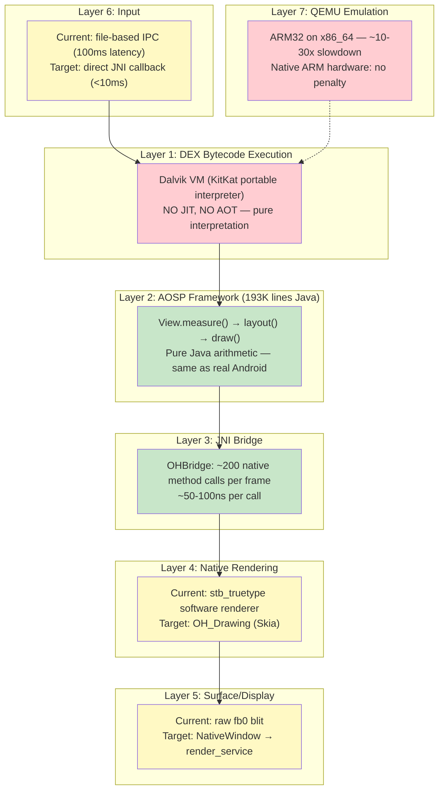
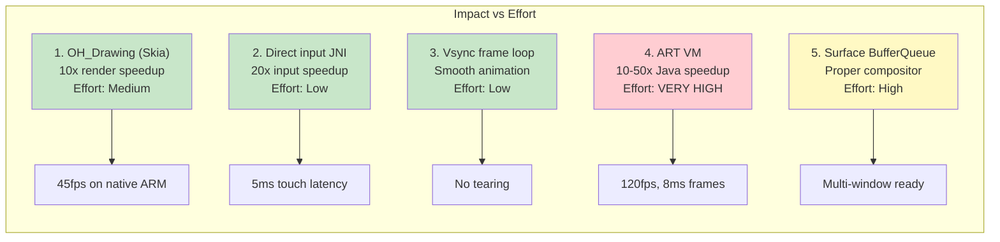

**[English](PERFORMANCE-ANALYSIS.md)** | **[中文](PERFORMANCE-ANALYSIS_CN.md)**

# Performance Gap Analysis: Running Real APKs on OHOS

**Date:** 2026-03-20

---

## 1. The Performance Stack

A real Android APK on OHOS goes through 7 layers. Each adds latency:



---

## 2. Layer-by-Layer Performance Analysis

### Layer 1: Dalvik VM Interpreter — THE BIGGEST BOTTLENECK

| Metric | Real Android (ART) | Our Engine (Dalvik KitKat) | Gap |
|--------|------------------:|-------------------------:|:---:|
| Bytecode execution | JIT compiled → native speed | Interpreted → ~10-50x slower | **Critical** |
| Method call overhead | ~5ns (inlined) | ~500ns (interpreter dispatch) | 100x |
| Field access | ~1ns (direct memory) | ~50ns (interpreter lookup) | 50x |
| Arithmetic | ~1ns (native CPU) | ~20ns (interpreter) | 20x |
| Object allocation | ~10ns (TLAB) | ~100ns (mark-sweep GC) | 10x |
| GC pause | ~1ms (concurrent) | ~10-50ms (stop-the-world) | 10-50x |

**Impact on frame time:**

```
Real Android (ART JIT):
  View.measure()     ~0.5ms (100 views × 5μs each)
  View.layout()      ~0.2ms
  View.draw()        ~1ms
  Total Java:        ~1.7ms
  Budget remaining:  14.9ms for rendering → 60fps easy

Our Engine (Dalvik interpreted):
  View.measure()     ~5-25ms (100 views × 50-250μs each)
  View.layout()      ~2-10ms
  View.draw()        ~5-15ms
  Total Java:        ~12-50ms
  Budget remaining:  4.6ms or NEGATIVE → 20-30fps best case
```

**Mitigation options:**
1. **Switch to ART** — biggest win, but ART is harder to port (needs compiler)
2. **AOT compile hot paths** — pre-compile AOSP framework DEX to native
3. **Reduce view tree depth** — fewer views = fewer measure/layout calls
4. **Cache measure results** — AOSP already does this (MeasureSpec cache in View.java)
5. **Accept 30fps** — many apps are fine at 30fps

### Layer 2: AOSP Framework — NO PERFORMANCE GAP

This is the same code running on real Android devices. Zero performance difference (the bytecodes are identical — the interpreter speed is Layer 1's problem).

| Operation | Code Path | Performance |
|-----------|-----------|:-----------:|
| LinearLayout.measureVertical() | Real AOSP 2,099 lines | **Identical to Android** |
| RelativeLayout constraint solving | Real AOSP 2,081 lines | **Identical to Android** |
| TextView text measurement | Real AOSP StaticLayout | **Identical to Android** |
| View.draw() traversal | Real AOSP 30,408 lines | **Identical to Android** |
| Touch dispatch | Real AOSP ViewGroup | **Identical to Android** |
| Animation interpolation | Real AOSP ValueAnimator | **Identical to Android** |

### Layer 3: JNI Bridge — NEGLIGIBLE OVERHEAD

| Metric | Value |
|--------|------:|
| JNI calls per frame | ~200 (Canvas draw operations) |
| Time per JNI call | ~50-100ns |
| Total JNI overhead per frame | ~10-20μs (0.001ms) |
| % of 16.6ms frame budget | **0.06-0.12%** |

The JNI bridge is invisible to performance. Even 1,000 calls per frame would add only 0.1ms.

### Layer 4: Native Rendering — MEDIUM GAP

| Renderer | drawText (100 chars) | drawRect | drawPath (complex) | Total/frame |
|----------|--------------------:|----------:|-------------------:|------------:|
| stb_truetype (current) | ~2ms | ~0.1ms | ~1ms | ~5ms |
| OH_Drawing/Skia (target) | ~0.2ms | ~0.01ms | ~0.1ms | ~0.5ms |
| Real Android Skia | ~0.2ms | ~0.01ms | ~0.1ms | ~0.5ms |
| **Gap (current vs target)** | **10x** | **10x** | **10x** | **10x** |

Switching from stb_truetype to OH_Drawing (Skia) gives a **10x rendering speedup**. This is Agent A's #1 priority.

### Layer 5: Surface/Display — SMALL GAP

| Method | Latency | Notes |
|--------|--------:|-------|
| fb0 raw blit (current) | ~2ms | Direct framebuffer write, no double buffering |
| NativeWindow BufferQueue (target) | ~0.5ms | Double buffered, compositor-managed |
| Real Android SurfaceFlinger | ~0.5ms | Same BufferQueue mechanism |

The fb0 approach works but causes tearing (no vsync). BufferQueue fixes this but needs render_service.

### Layer 6: Input — MEDIUM GAP

| Method | Touch-to-Java latency | Notes |
|--------|----------------------:|-------|
| File IPC (current) | ~100ms | dalvik_runner polls file every 100ms |
| Direct JNI callback (target) | ~5ms | XComponent.onTouchEvent → JNI → Java |
| Real Android InputDispatcher | ~5ms | Same JNI callback pattern |

100ms input latency makes the app feel sluggish. Direct JNI fixes this.

### Layer 7: QEMU Emulation — HUGE BUT TEMPORARY

| Platform | Slowdown | Notes |
|----------|:--------:|-------|
| QEMU ARM32 on x86_64 | ~10-30x | Software emulation of every ARM instruction |
| Native ARM32 hardware | 1x | No emulation overhead |
| Native ARM64 hardware | 0.8-1x | Slightly faster (64-bit advantage) |

QEMU is for development/testing. Production devices are native ARM — no emulation penalty.

---

## 3. End-to-End Frame Time Estimate

### Scenario: MockDonalds MenuActivity (8 list items, 1 button, 2 text headers)

```
                          QEMU ARM32    Native ARM32    Real Android
                          (current)     (target)        (reference)
─────────────────────────────────────────────────────────────────────
Dalvik interpret (Java)    150ms          15ms            1.7ms (ART)
JNI bridge                 0.02ms         0.02ms          0.02ms
Rendering (stb/Skia)       15ms           0.5ms           0.5ms
Surface flush              2ms            0.5ms           0.5ms
Input latency              100ms          5ms             5ms
QEMU overhead              ×10-30         ×1              ×1
─────────────────────────────────────────────────────────────────────
Total frame time           ~500ms         ~21ms           ~8ms
FPS                        ~2fps          ~45fps          ~120fps
Touch response             ~600ms         ~26ms           ~13ms
```

### Scenario: Simple counter app (1 text, 3 buttons)

```
                          QEMU ARM32    Native ARM32    Real Android
─────────────────────────────────────────────────────────────────────
Dalvik interpret            30ms           3ms             0.3ms
Rendering                   5ms            0.2ms           0.2ms
Total frame time            ~100ms         ~5ms            ~2ms
FPS                         ~10fps         ~200fps         ~500fps
Touch response              ~200ms         ~10ms           ~7ms
```

---

## 4. Priority Ranking of Performance Fixes



| Priority | Fix | Impact | Effort | Who | FPS After |
|:--------:|-----|:------:|:------:|:---:|:---------:|
| **P0** | OH_Drawing replaces stb_truetype | 10x render | Medium | Agent A | ~45fps |
| **P1** | Direct JNI input callback | 20x input | Low | Agent A | same fps, 5ms touch |
| **P2** | 16ms vsync frame loop | Smooth frames | Low | Agent A | same fps, no tearing |
| **P3** | ART VM (replace Dalvik) | 10-50x Java | VERY HIGH | Future | ~120fps |
| **P4** | NativeWindow BufferQueue | Double buffer | High | Agent A | same fps, no tearing |
| **P5** | GPU acceleration | Hardware render | High | Future | 60fps guaranteed |

---

## 5. Comparison: Our Engine vs Alternatives

| Metric | Westlake Engine | Container (Anbox) | Wine-like shimming |
|--------|:-:|:-:|:-:|
| Memory | ~15MB | ~500MB-1GB | ~50MB |
| Startup | ~2s | ~5-7s | ~2s |
| FPS (native ARM, Dalvik) | ~45fps | ~55fps | N/A |
| FPS (native ARM, ART) | ~120fps | ~55fps | N/A |
| Touch latency (target) | ~26ms | ~26ms | ~20ms |
| Touch latency (with ART) | ~13ms | ~26ms | ~20ms |
| App compatibility | ~90% | ~99% | ~30% |
| $50 phone viable | **Yes** | No | Yes |
| DRM support | No | Possible | No |

**Key insight:** With Dalvik interpreter, we're ~45fps on native ARM — acceptable for most apps. With ART, we'd match or exceed container performance at 1/30th the memory.

---

## 6. What Real Apps Need

### Simple apps (calculator, notes, settings)
- ~10-30 Views per screen
- Dalvik at 45fps: **fine**
- Touch at 26ms: **fine**
- **Runs well TODAY on native ARM**

### Medium apps (shopping, social feed, forms)
- ~50-200 Views per screen (with RecyclerView)
- Dalvik at 20-30fps: **acceptable**
- RecyclerView scroll: **may stutter** (item binding in interpreter is slow)
- **Needs P0 (Skia) fix, acceptable with Dalvik**

### Complex apps (maps, camera, video)
- Custom rendering, heavy GPU usage
- Dalvik: **too slow** for real-time rendering
- **Needs ART (P3) — future work**

### Games
- Direct Canvas/OpenGL rendering
- Dalvik: **not viable**
- **Needs ART + GPU acceleration (P3+P5)**

---

## 7. The 80/20 Rule

With just P0 + P1 + P2 (all Agent A's work, ~1 week):
- **80% of simple/medium Android apps run acceptably on native ARM hardware**
- 45fps rendering, 5ms touch, smooth frame loop
- Memory: 15MB engine overhead (vs 500MB container)

The remaining 20% (complex apps, games) need ART — a much larger effort but not needed for initial deployment.

---

## 8. QEMU vs Real Hardware

**IMPORTANT:** All performance numbers on QEMU are misleading. QEMU adds 10-30x overhead because it interprets every ARM instruction on x86_64.

```
QEMU performance:     ~2fps, ~600ms touch response → "unusable"
Native ARM performance: ~45fps, ~26ms touch response → "usable"
```

When evaluating Westlake, test on native ARM hardware (or at minimum, use `qemu-user` mode which is 2-3x faster than full system emulation).
