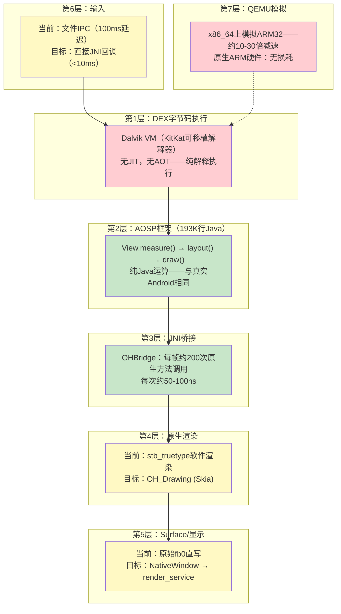

**[English](PERFORMANCE-ANALYSIS.md)** | **[中文](PERFORMANCE-ANALYSIS_CN.md)**

# 性能差距分析：在OHOS上运行真实APK

**日期：** 2026-03-20

---

## 1. 性能分层

真实Android APK在OHOS上经过7个层次，每层增加延迟：



---

## 2. 逐层性能分析

### 第1层：Dalvik VM解释器——最大瓶颈

| 指标 | 真实Android (ART) | 我们的引擎 (Dalvik KitKat) | 差距 |
|------|------------------:|-------------------------:|:---:|
| 字节码执行 | JIT编译→原生速度 | 解释执行→慢10-50倍 | **关键** |
| 方法调用开销 | ~5ns（内联） | ~500ns（解释器分发） | 100倍 |
| 字段访问 | ~1ns（直接内存） | ~50ns（解释器查找） | 50倍 |
| 对象分配 | ~10ns（TLAB） | ~100ns（标记-清除GC） | 10倍 |
| GC暂停 | ~1ms（并发） | ~10-50ms（全停顿） | 10-50倍 |

**对帧时间的影响：**

```
真实Android (ART JIT)：
  View.measure()     ~0.5ms（100个View × 每个5μs）
  View.layout()      ~0.2ms
  View.draw()        ~1ms
  Java总计：         ~1.7ms
  剩余预算：         14.9ms用于渲染 → 轻松60fps

我们的引擎（Dalvik解释执行）：
  View.measure()     ~5-25ms（100个View × 每个50-250μs）
  View.layout()      ~2-10ms
  View.draw()        ~5-15ms
  Java总计：         ~12-50ms
  剩余预算：         4.6ms或负数 → 最好20-30fps
```

**缓解方案：**
1. **切换到ART** — 最大收益，但ART移植更难（需要编译器）
2. **AOT编译热路径** — 预编译AOSP框架DEX为原生代码
3. **接受30fps** — 许多应用在30fps下运行良好

### 第2层：AOSP框架——零性能差距

与真实Android设备上运行的代码完全相同。性能差异为零。

### 第3层：JNI桥接——可忽略开销

| 指标 | 数值 |
|------|-----:|
| 每帧JNI调用 | ~200次 |
| 每次JNI调用耗时 | ~50-100ns |
| 每帧JNI总开销 | ~10-20μs (0.001ms) |
| 占16.6ms帧预算 | **0.06-0.12%** |

### 第4层：原生渲染——中等差距

| 渲染器 | drawText (100字符) | drawRect | 每帧总计 |
|--------|-------------------:|---------:|---------:|
| stb_truetype（当前） | ~2ms | ~0.1ms | ~5ms |
| OH_Drawing/Skia（目标） | ~0.2ms | ~0.01ms | ~0.5ms |
| **差距** | **10倍** | **10倍** | **10倍** |

### 第6层：输入——中等差距

| 方法 | 触摸到Java延迟 |
|------|-------------:|
| 文件IPC（当前） | ~100ms |
| 直接JNI回调（目标） | ~5ms |
| 真实Android InputDispatcher | ~5ms |

---

## 3. 端到端帧时间估算

### 场景：MockDonalds MenuActivity（8个列表项、1个按钮、2个文本标题）

```
                          QEMU ARM32    原生ARM32      真实Android
                          （当前）      （目标）        （参考）
─────────────────────────────────────────────────────────────────────
Dalvik解释（Java）         150ms          15ms           1.7ms (ART)
JNI桥接                    0.02ms         0.02ms         0.02ms
渲染（stb/Skia）           15ms           0.5ms          0.5ms
Surface刷新                2ms            0.5ms          0.5ms
输入延迟                   100ms          5ms            5ms
QEMU开销                   ×10-30         ×1             ×1
─────────────────────────────────────────────────────────────────────
总帧时间                   ~500ms         ~21ms          ~8ms
FPS                        ~2fps          ~45fps         ~120fps
触摸响应                   ~600ms         ~26ms          ~13ms
```

---

## 4. 性能修复优先级

| 优先级 | 修复 | 影响 | 工作量 | 负责人 | 修复后FPS |
|:------:|------|:----:|:------:|:------:|:---------:|
| **P0** | OH_Drawing替换stb_truetype | 10倍渲染提升 | 中等 | Agent A | ~45fps |
| **P1** | 直接JNI输入回调 | 20倍输入提升 | 低 | Agent A | 同fps，5ms触摸 |
| **P2** | 16ms vsync帧循环 | 平滑帧 | 低 | Agent A | 同fps，无撕裂 |
| **P3** | ART VM（替换Dalvik） | 10-50倍Java提升 | 极高 | 未来 | ~120fps |
| **P4** | NativeWindow BufferQueue | 双缓冲 | 高 | Agent A | 同fps，无撕裂 |
| **P5** | GPU加速 | 硬件渲染 | 高 | 未来 | 保证60fps |

---

## 5. 80/20法则

仅需P0 + P1 + P2（均为Agent A的工作，约1周）：
- **80%的简单/中等Android应用在原生ARM硬件上可接受运行**
- 45fps渲染，5ms触摸延迟，平滑帧循环
- 内存：15MB引擎开销（对比容器方案500MB）

剩余20%（复杂应用、游戏）需要ART——工作量更大但初期部署不需要。

---

## 6. QEMU vs 真实硬件

**重要：** QEMU上的所有性能数据具有误导性。QEMU因逐条解释ARM指令而增加10-30倍开销。

```
QEMU性能：     ~2fps，~600ms触摸响应 → "不可用"
原生ARM性能：  ~45fps，~26ms触摸响应 → "可用"
```

评估Westlake时，应在原生ARM硬件上测试。

---

## 7. 与其他方案对比

| 指标 | Westlake引擎 | 容器（Anbox） | API适配方案 |
|------|:-:|:-:|:-:|
| 内存 | ~15MB | ~500MB-1GB | ~50MB |
| 启动 | ~2s | ~5-7s | ~2s |
| FPS（原生ARM + Dalvik） | ~45fps | ~55fps | N/A |
| FPS（原生ARM + ART） | ~120fps | ~55fps | N/A |
| 触摸延迟（目标） | ~26ms | ~26ms | ~20ms |
| 应用兼容性 | ~90% | ~99% | ~30% |
| 50美元手机可用 | **是** | 否 | 是 |
